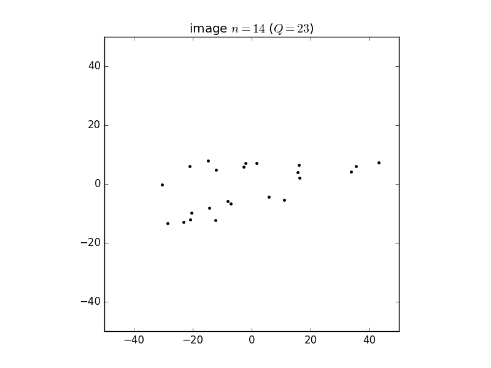

Isotropic case:
---------------

Example low-photon images:

Video of fitting process:
<iframe width="560" height="315" src="https://www.youtube.com/embed/pqTb3y8Agx4" frameborder="0" allowfullscreen></iframe>

True data these were generated from:

Anisotropic case:

Fitting:
<iframe width="560" height="315" src="https://www.youtube.com/embed/RkA5-lhMlLI" frameborder="0" allowfullscreen></iframe>

True data:

Angle distribution
