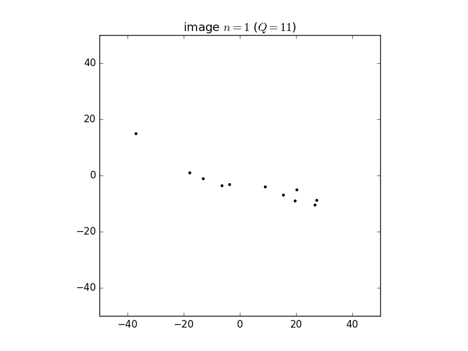

Basic Idea:
-----------
We have a bunch of very-low photon images of the same object, each taken from a many different viewing angles, but we don't know those angles. We want to infer the 3D structure of the original object (a molecule in this case) from many of these extremely low-count images.

Isotropic case:
---------------

Here is a small sample of the test dataset of very low photon count images (average 16 photons each).

Example low-photon images:

<!-- 

 -->

Here is a video of the stochastic gradient inferring the 3D structure from 16,384 such images.

Video of fitting process:
https://youtu.be/RkA5-lhMlLI
<iframe width="560" height="315" src="https://www.youtube.com/embed/pqTb3y8Agx4" frameborder="0" allowfullscreen></iframe>

Here is an image of the true 3D structure that generated the low-photon images – note NOT a mixture of gaussians like the model used for inference.

True data these were generated from:

Anisotropic case:
-----------------

We also tried with an awful anisotropic distribution of angles. The fitting still works surprisingly well (video)!

<!-- 

 -->

Fitting:
https://youtu.be/pqTb3y8Agx4
<iframe width="560" height="315" src="https://www.youtube.com/embed/RkA5-lhMlLI" frameborder="0" allowfullscreen></iframe>

True data:

Angle distribution
